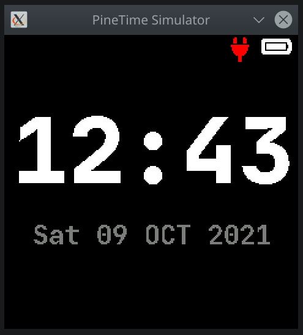

# pinetime-rs

Rust & [RTIC](https://rtic.rs/dev/book/en/) running on the PineTime watch.

See the [PineTime Wiki](https://wiki.pine64.org/index.php/PineTime) for docs.

```bash
cargo install probe-run cargo-embed flip-link
```

Run with `cargo run --release` or `cargo embed --release`.

## Simulator

See [pinetime-simulator](host-tools/pinetime-simulator) crate.



## TODOs

* Redo linker scripts so image goes into the existing bootloader's firmware slot and use the bootloader update procedure
* Do on-device unit tests with [defmt-test](https://github.com/knurling-rs/defmt/tree/main/firmware/defmt-test)
